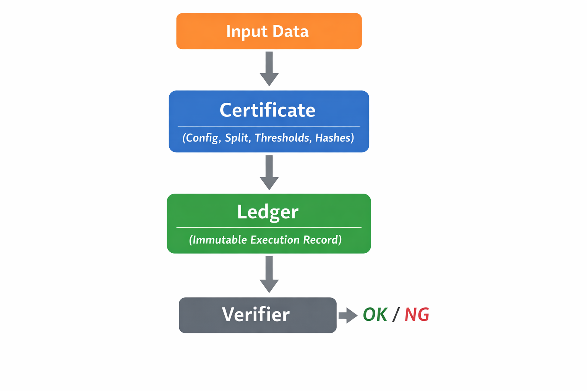

**Certificate-Based Drift Detection Audit for Time-Series Forecasting (Electricity Demand × Weather)**

**Keywords:** drift detection, time-series forecasting, model monitoring, MLOps, audit trail, reproducibility, accountability, electricity demand forecasting



*End-to-end audit flow: fixed certificate → immutable ledger → independent verifier (OK / NG).*

ghost-drift-audit is a certificate-based **drift detection and model monitoring audit engine for operational time-series forecasting (MLOps)**. It fixes distribution shift / regime shift evaluation as a **reproducible audit protocol with an immutable audit trail**, enabling third parties to regenerate the same OK/NG verdict from identical inputs.
Note: The bundled CSV files are dummy data for smoke testing only; the published audit certificates target real electricity demand × weather data (Jan–Apr 2024).
As a case study, this repository audits **electricity demand forecasting models** using power demand × weather time-series data (Jan–Apr 2024), and outputs certificates, ledgers, and evidence time series as reproducible audit artifacts.

## 🔗 Quick Links

* 📂 **Source Code:** [GitHub Repository](https://github.com/GhostDriftTheory/ghostdrift-adic-audit)
* 📜 **Main Script:** [ghost_drift_audit_EN.py](https://github.com/GhostDriftTheory/ghostdrift-adic-audit/blob/main/ghost_drift_audit_EN.py)
* 📦 **Download:** [Project ZIP](https://github.com/GhostDriftTheory/ghostdrift-adic-audit/archive/refs/heads/main.zip)
* 📖 **Documentation:** [Online Manual](https://ghostdrifttheory.github.io/ghostdrift-adic-audit/) ([⚙️ Jump to Execution Mode](https://ghostdrifttheory.github.io/ghostdrift-adic-audit/#profile))
* 🚨 **Support:** [Report Issues](https://github.com/GhostDriftTheory/ghostdrift-adic-audit/issues)

---

## 📑 Audit Report (PDF)

- **Report:** [Scientific Audit Report on Structural Integrity of Forecasting Models](./Scientific%20Audit%20Report%20on%20Structural%20Integrity%20of%20Forecasting%20Models.pdf)
- **Verdict:** NG (TAU_CAP_HIT)
- **Protocol:** Ghost Drift Audit v8.0

---

## 💎 Design Philosophy: From "Probabilistic" to "Accountable"

To address the “opaque inference” problem in conventional AI operations, this framework provides the following.

> [!TIP]
> **Audit-First Design**
> Alongside running predictions, it automatically generates objectively verifiable **evidence** for third parties.

> [!IMPORTANT]
> **Tamper-evident Fingerprints**
> It fixes hash fingerprints of input data and configuration parameters, making post-hoc modifications mathematically detectable.

> [!NOTE]
> **Verifiable Integrity**
> Rather than mere statistical optimality, it makes visible the model’s **faithful adherence** to operational rules.

---

## 🛠 Technical Specifications

### System Requirements

* **Language:** Python 3.10+
* **Dependencies:** numpy, pandas, matplotlib, lightgbm

### Project Structure

```text
.
├── ghost_drift_audit_JP.py    # Core Logic & Audit Engine
├── electric_load_weather.csv  # Input: Weather (dummy for smoke test)
├── power_usage.csv            # Input: Demand (dummy for smoke test)
└── adic_out/                  # Output: Accountability Ledger
```

---

<a id="profile"></a>

## ⚙️ Execution Profiles

Switch the strictness of the audit via `AUDIT_CONFIG['PROFILE']`.

| Profile    | Use / Target                        | Strictness | Key Features                                           |
| ---------- | ----------------------------------- | ---------: | ------------------------------------------------------ |
| demo       | Smoke test / learning               |        Low | Prioritizes understanding behavior and evidence output |
| paper      | Research / reproducible experiments |        Mid | Ensures computational reproducibility via fixed seeds  |
| commercial | Production / decision-making        |       High | Produces strict gate checks and a final verdict        |

### How to Configure

```python
AUDIT_CONFIG = {
  "PROFILE": "demo",  # "demo" | "paper" | "commercial"
}
```

---

## 🚀 Deployment & Usage

### 1. Setup

```bash
pip install numpy pandas matplotlib lightgbm
```

### 2. Prepare Data

Place the CSV files in the same directory as the `.py`.

> [!CAUTION]
> The bundled CSVs are synthetic (dummy) data.
> They are for smoke testing only; for production use or research, use real data for which you hold the rights.

### 3. Run

```bash
python ghost_drift_audit_JP.py
```

### 4. Verification (adic_out/)

* 📜 **certificate.json:** a “certificate” of execution conditions and verdict summary
* 📑 **ledger.csv:** an immutable “ledger” that records the full history
* 📉 **evidence_timeseries.csv:** time-series evidence for re-verification

---

## ⚖️ Scope & Integrity (Non-claims)

### 🎯 Scope & Limits

* **Scope:** Make the model’s behavior and assumption failures observable, and fix an audit trail for intervention decisions.
* **Non-claims:** Does not guarantee zero future error, a mathematically “unique correct answer,” or generalization in extrapolation regimes.

### 🛡️ Threat Model (Tamper Detection)

* **Threshold manipulation:** Arbitrary changes to conceal anomalies → detected via Cap records
* **Baseline manipulation:** Post-hoc changes to comparison baselines → detected via config fingerprint mismatches
* **Data fabrication:** Input swapping or fabrication → verified against Data Fingerprints

---

## 📜 License & Acknowledgments

* **Code:** MIT License
* **Data:** Synthetic dataset for demonstration.

**From “prediction” to “accountability.”**
This repository provides a practical reference implementation for certificate-based drift detection, audit trails, and accountable model monitoring in time-series forecasting systems.
Produced by **GhostDrift Mathematical Institute (GMI)** — [Official Website](https://www.ghostdriftresearch.com/) | [Online Documentation](https://ghostdrifttheory.github.io/ghostdrift-adic-audit/)
